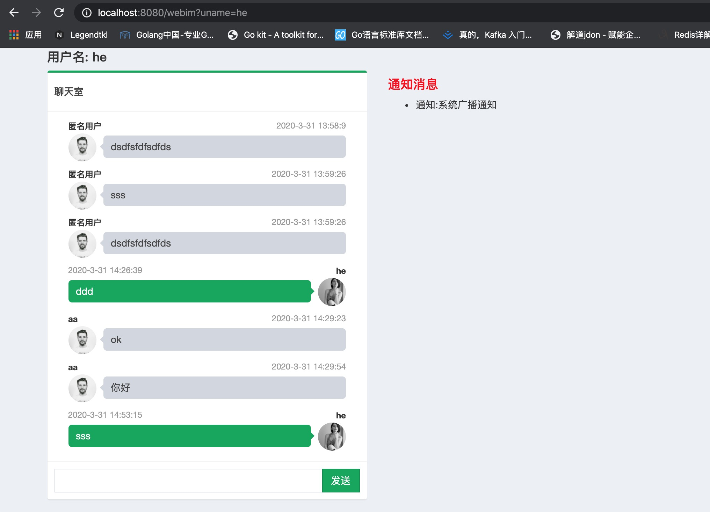

# Web IM
主要功能
1. 群聊
2. 单聊
3. 登录登出
4. 广播  (用户想全部在线用户推送消息)
5. 单播 （可用于向app推送消息）


## Usage

cd webim/comet

bee run

```
聊天室和相关接口  http://127.0.0.1:8080 

beego进程监控 http://127.0.0.1:8088/
```

## API 接口说明

```
 / 聊天室欢迎页(登录页)
 /webim  聊天室主页
 /room/create  //创建聊天室接口
 /room/delete  //删除聊天室接口
 /ws           //websoket长链接
```

 /push/unicast   //单播推送接口
``` 
method post
body
    {
		"device_token":"580ddd1f50f561a0968fa5fcd0cdad05",
		"msg":{
			"type":0,
			"data":"{\"content\":\"单播消息\"}"
		}
	}
```
 /push/broadcast  //广播推送接口
 ``` 
method post
body
    {
		"msg":{
			"type":10,
			"data":"{\"content\":\"广播消息\"}"
		}
	}
```
 /monitor/status  //系统监控接口

/user/register    //用户注册
## 附录
消息类型
```
const (
	TYPE_COMMON_MSG  = float64(0)   //单个用户消息
	TYPE_ROOM_MSG    = float64(1)   //聊天室消息 到聊天室所有的人
	TYPE_JOIN_ROOM   = float64(2)   //进入房间
	TYPE_LEAVE_ROOM  = float64(3)   //退出房间
	TYPE_CREATE_ROOM = float64(4)   //创建房间
	TYPE_LOGIN       = float64(5)   //登录
	TYPE_LOGOUT      = float64(6)   //退出
	TYPE_NOTICE_MSG  = float64(10)  //通知类消息广播
	TYPE_REGISTER    = float64(11)  //注册设备生成deviceToken
	TYPE_TRANSPOND   = float64(12)  //将消息转发到其他系统微服务，并将其他系统获取的结果返回给客户端
	TYPE_PING        = float64(99)  //PING
	TYPE_PONG        = float64(100) //PONG
)
```